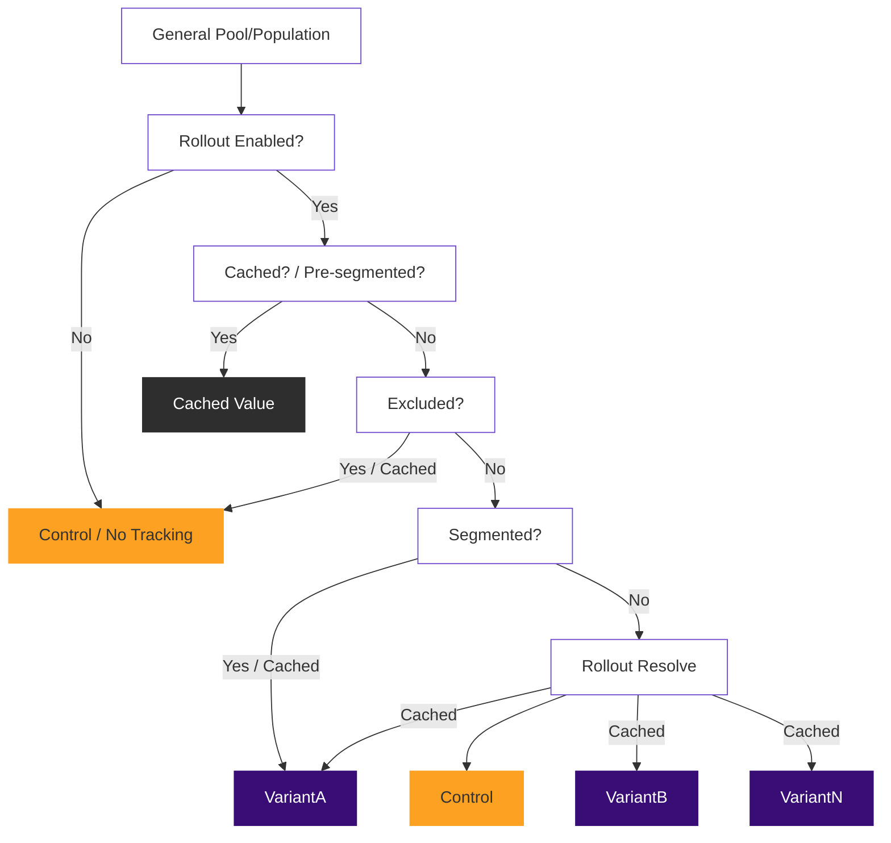

GitLab Experiment
=================


This README represents the current main branch and may not be applicable to the release you're using in your project. Please refer to the correct release branch if you'd like to review documentation relevant for that release.

Here at GitLab we run experiments as A/B/n tests and review the data the experiment generates. From that data, we determine the best performing code path and promote it as the new default code path, or revert back to the original code path. You can read our [Experiment Guide](https://docs.gitlab.com/ee/development/experiment_guide/) documentation if you're curious about how we use this gem internally at GitLab.

This library provides a clean and elegant DSL (domain specific language) to define, run, and track your experiments.

When we discuss the behavior of this gem, we'll use terms like experiment, context, control, candidate, and variant. It's worth defining these terms so they're more understood.

- `experiment` is any deviation of code paths we want to run sometimes and not others.
- `context` is used to identify a consistent experience we'll provide in an experiment.
- `control` is the default, or "original" code path.
- `candidate` defines that there's one experimental code path.
- `variant(s)` is used when more than one experimental code path exists.
- `behaviors` is used to reference all possible code paths of an experiment.

Candidate and variant are the same concept, but simplify how we speak about experimental paths -- both are widely referred to as the "experiment group". If you use "control and candidate," the assumption is an A/B test, and if you say "variants" the assumption is a multiple variant experiment.

Behaviors is a general term for all code paths -- if that's control and candidate, or control and variants. It's all of them.
<br clear="all">

[[_TOC_]]

## Installation

Add the gem to your Gemfile and then `bundle install`.

```ruby
gem 'gitlab-experiment'
```

If you're using Rails, you can install the initializer which provides basic configuration, documentation, and the base experiment class that all your experiments can inherit from.

```shell
$ rails generate gitlab:experiment:install
```

## Implementing an experiment

For the sake of having a simple example let's define an experiment around a button color, even if it's not how we'd likely implement a real experiment it makes for a clean example.

Currently our button is blue, but we want to test out a red variant. Our hypothesis is that a red button will make it more visible but also might appear like a warning button -- this is why we're testing our hypothesis.

So let's name our experiment `pill_color`, and use the generator to get some files:

```shell
$ rails generate gitlab:experiment pill_color
``` 

This generator will give us an `app/experiments/pill_color_experiment.rb` file, which we can use to define our experiment class and register our default variant behaviors. The generator also provides a bunch of useful comments in this file unless you `--skip-comments`, so feel free to play around with that.

Let's fill out our control and candidate behaviors with some default values to start. For our example it'll just be some made up class names where we've defined our colors.

```ruby
class PillColorExperiment < ApplicationExperiment
  control { 'blue' } # register and define our default control value
  candidate { 'red' } # register and define our experimental candidate value
end
```

Now that we've defined our default behaviors, we can utilize our experiment elsewhere by calling the `experiment` method. When you run (or publish) an experiment you'll need to provide a name and a context. The name is how our `PillColorExperiment` class is resolved and will also show up in event data downstream. The context is a hash that's used to determine the variant assigned and should be consistent between calls.

For our experiment we're going to make it "sticky" to the current user -- and if there isn't a current user, we want to assign and use a cookie value instead. This happens automatically if you use the [`actor` keyword](#cookies-and-the-actor-keyword) in your context. We use that in a lot of our examples, but it's by no means how everything should be done.

```haml
%button{ class: experiment(:pill_color, actor: current_user).run } Click Me!
```

Now when our view is rendered, the class attribute of the button will be pulled from the experiment and will be sticky to the user that's viewing it.

You can also provide behavior overrides when you run the experiment. Let's use a view helper for this example because it'll be cleaner than putting our override blocks into the view.

```ruby
def pill_color_experiment
  experiment(:pill_color, actor: current_user) do |e|
    e.candidate { 'purple' } # override the candidate default of 'red'
  end
end
```

Now we can run the experiment using that helper method. Instead of a red button, users who are assigned the candidate will be given a purple button. Users in the control group will still see the blue button. Using experiments in this way permits a default experiment to be defined while also allowing the experiment to be customized in the places where its run, using the scope, variables and helper methods that are available to us where we want to run the experiment.

```haml
%button{ class: pill_color_experiment.run } Click Me!
```

Understanding how an experiment can change user behavior or engagement is important in evaluating its performance. To this end, you'll probably want to track events that are important elsewhere in code. By using the same context you can provide a consistent experience and have the ability to anonymously track events to that experience.

```ruby
experiment(:pill_color, actor: current_user).track(:clicked)
```

## Advanced experimentation

Now let's create a more complex experiment with multiple variants. This time we'll start with a grey button, and have red and blue variants.

We'll also do more advanced segmentation when the experiment is run, exclude certain cases, and register callbacks that will be executed after our experiment is run. Here are some examples of what we can start to do in our experiment classes:

```ruby
class PillColorExperiment < Gitlab::Experiment # OR ApplicationExperiment
  # Register our behaviors.  
  control # register our control, which will by default call #control_behavior
  variant(:red) # register the red variant that will call #red_behavior
  variant(:blue) # register the blue variant that will call #blue_behavior

  # Exclude any users that are named "Richard".
  exclude :users_named_richard

  # Segment any account older than 2 weeks into the red variant without asking
  # the rollout strategy to assign a variant.
  segment :old_account?, variant: :red
  
  # After the experiment has been run, we want to log some performance metrics.
  after_run { log_performance_metrics }

  private
  
  # Define the default control behavior, which can be overridden on runs.
  def control_behavior
    'grey'
  end

  # Define the default red behavior, which can be overridden on runs.
  def red_behavior
    'red'
  end

  # Define the default blue behavior, which can be overridden on runs.
  def blue_behavior
    'blue'
  end

  # Define our special exclusion logic.
  def users_named_richard
    context.try(:actor)&.first_name == 'Richard' # use try for nil actors
  end

  # Define our segmentation logic.
  def old_account?
    context.try(:actor) && context.actor.created_at < 2.weeks.ago
  end
    
  # Let's assume that we've tracked this and want to push it into some system.
  def log_performance_metrics
    # ...hypothetical implementation 
  end
end
```

You can play around with our new `PillColorExperiment` using a console or irb session. In our example we've used an actual `User` model with a first name and timestamps. Feel free to use something more appropriate for your project in your exploration, or just not pass in `actor` at all.

```ruby
include Gitlab::Experiment::Dsl

# The class will be looked up based on the experiment name provided. 
ex = experiment(:pill_color, actor: User.first) # => #<PillColorExperiment:0x...>

# Run the experiment -- returning the result.
ex.run # => "grey" (the value defined in our control)

# Track an event on the experiment we've defined, using the logic we've defined
# in configuration.
ex.track(:clicked) # => true

# Publish the experiment without running it, using the logic we've defined in
# configuration.
ex.publish # => {:variant=>"control", :experiment=>"pill_color", :key=>"45f595...", :excluded=>false}
```

<details>
  <summary>You can also specify the variant manually...</summary>

Generally, defining segmentation rules is a better way to approach routing into specific variants, but it's possible to explicitly specify the variant when running an experiment.

Caching: It's important to understand what this might do to your data during rollout, so use this with careful consideration. Any time a specific variant is assigned manually, or through segmentation (including `:control`) it will be cached for that context. That means that if you manually assign `:control`, that context will never be moved out of the control unless you do it programmatically elsewhere.

```ruby
include Gitlab::Experiment::Dsl

# Assign the candidate manually.
ex = experiment(:pill_color, :red, actor: User.first) # => #<PillColorExperiment:0x..>

# Run the experiment -- returning the result.
ex.run # => "red"

# If caching is enabled this will remain sticky between calls.
experiment(:pill_color, actor: User.first).run # => "red"
```

</details>

### Exclusion rules

Exclusion rules let us determine if a context should even be considered as something to include in an experiment. If we're excluding something, it means that we don't want to run the experiment in that case. This can be useful if you only want to run experiments on new users for instance.

```ruby
class PillColorExperiment < Gitlab::Experiment # OR ApplicationExperiment
  # ...registered behaviors

  exclude :old_account?, ->{ context.actor.first_name == 'Richard' }
end
```

In the previous example, we'll exclude all users named `'Richard'` as well as any account older than 2 weeks old. Not only will they be immediately given the control behavior, but no events will be tracked in these cases either.

Exclusion rules are executed in the order they're defined. The first exclusion rule to produce a truthy result will halt execution of further exclusion checks.

Note: Although tracking calls will be ignored on all exclusions, you may want to check exclusion yourself in expensive custom logic by calling the `should_track?` or `excluded?` methods.

Note: When using exclusion rules it's important to understand that the control assignment is cached, which improves future experiment run performance but can be a gotcha around caching.

Note: Exclusion rules aren't the best way to determine if an experiment is enabled. There's an `enabled?` method that can be overridden to have a high-level way of determining if an experiment should be running and tracking at all. This `enabled?` check should be as efficient as possible because it's the first early opt out path an experiment can implement. This can be seen in [How it works](#how-it-works).

### Segmentation rules

Segmentation, or assigning certain variants in certain cases, is important to running experiments. This can be useful if you want to push a given population into a specific variant because you've already determined that variant is successful for that population.

```ruby
class PillColorExperiment < Gitlab::Experiment # OR ApplicationExperiment
  # ...registered behaviors
    
  segment(variant: :red) { context.actor.first_name == 'Richard' }
  segment :old_account?, variant: :blue
end
```

In the previous example, any user named `'Richard'` would always receive the experience defined in the red variant. As well, any account older than 2 weeks would get the alternate experience defined in the blue variant.

Segmentation rules are executed in the order they're defined. The first segmentation rule to produce a truthy result is the one which gets used to assign the variant. The remaining segmentation rules are skipped. This means that for our example, any user named `'Richard'` regardless of account age, will always be provided the experience as defined in the red variant.

### Run callbacks

Callbacks can be registered for when you want to execute logic before, after, or around when an experiment is run. These callbacks won't be called unless the experiment is actually run, meaning that exclusion rules take precedence.

```ruby
class PillColorExperiment < Gitlab::Experiment # OR ApplicationExperiment
  # ...registered behaviors
  
  after_run :log_performance_metrics, -> { publish_to_database }
end
```

In the previous example, we're going to call the `log_performance_method`, and do a hypothetical publish to the database. If you want to do an `around_run`, you just need to call the block:

```ruby
class PillColorExperiment < Gitlab::Experiment # OR ApplicationExperiment
  # ...registered behaviors

  around_run do |experiment, block|
    puts "- before #{experiment.name} run"
    block.call
    puts "- after #{experiment.name} run"
  end
end
```

### Rollout strategies

While a default rollout strategy can be defined in configuration, it's useful to be able to override this per experiment if needed. You can do this by specifying a specific `default_rollout` override in your experiment class.

```ruby
class PillColorExperiment < Gitlab::Experiment # OR ApplicationExperiment
  # ...registered behaviors

  default_rollout :random # randomly assign one of the registered behaviors
end
```

Obviously random assignment might not be the best rollout strategy for you, but you can define your own rollout strategies, or use one of the ones provided in the gem. You can read more about configuring the default rollout and how to write your own rollout strategies in the [configuration documentation](#rollout-strategies-1) for it.

## How it works

The way experiments work is best described using the following decision tree diagram. When an experiment is run, the following logic is executed to resolve what experience should be provided, given how the experiment is defined, and using the context passed to the experiment call.



## Technical details

This library is intended to be powerful and easy to use, which can lead to some complex underpinnings in the implementation. Some of those implementation details are important to understand at a technical level when considering how you want to design your experiments.

### Including the DSL

By default, `Gitlab::Experiment` injects itself into the controller, view, and mailer layers. This exposes the `experiment` method application wide in those layers. Some experiments may extend outside of those layers however, so you may want to include it elsewhere. For instance in an irb session or the rails console, or in all your service objects, background jobs, or similar.

```ruby
class ApplicationJob < ActiveJob::Base
  include Gitlab::Experiment::Dsl # include the `experiment` method for all jobs
end
```

### Experiment stickiness

Internally, experiments have what's referred to as the context "key" that represents the unique and anonymous id of a given context. This allows us to assign the same variant between different calls to the experiment, is used in caching and can be used in event data downstream. This context "key" is how an experiment remains "sticky" to a given context, and is an important aspect to understand.

You can specify what the experiment should be sticky to by providing the `:sticky_to` option. By default this will be the entire context, but this can be overridden manually if needed.

In a fabricated example, we might want to provide the user and a project to an experiment, but we want it to remain sticky to the project that the user is viewing and not the user viewing that project. This is a very powerful concept that you're encouraged to play around with to understand what it means, and how you can run complex experiments that aren't user centric.

```ruby
experiment(:example, actor: current_user, project: project, sticky_to: project)
```

### Experiment signature

The best way to understand the details of an experiment is through its signature. An example signature can be retrieved by calling the `signature` method, and looks like the following:

```ruby
experiment(:example).signature # => {:variant=>"control", :experiment=>"example", :key=>"4d7aee..."}
```

An experiment signature is useful when tracking events and when using experiments on the client layer. The signature can also contain the optional `migration_keys`, and `excluded` properties.

### Return value

By default the return value of calling `experiment` is a `Gitlab::Experiment` instance, or whatever class the experiment is resolved to, which likely inherits from `Gitlab::Experiment`. In simple cases you may want only the results of running the experiment though. You can call `run` within the block to get the return value of the assigned variant.

```ruby
# Normally an experiment instance.
experiment(:example) do |e|
  e.control { 'A' }
  e.candidate { 'B' }
end # => #<Gitlab::Experiment:0x...>

# But calling `run` causes the return value to be the result.
experiment(:example) do |e|
  e.control { 'A' }
  e.candidate { 'B' }
  e.run
end # => 'A'
```

### Context migrations

There are times when we need to change context while an experiment is running. We make this possible by passing the migration data to the experiment.

Take for instance, that you might be using `version: 1` in your context currently. To migrate this to `version: 2`, provide the portion of the context you wish to change using a `migrated_with` option.

In providing the context migration data, we can resolve an experience and its events all the way back. This can also help in keeping our cache relevant.

```ruby
# First implementation.
experiment(:example, actor: current_user, version: 1)

# Migrate just the `:version` portion.
experiment(:example, actor: current_user, version: 2, migrated_with: { version: 1 })
```

You can add or remove context by providing a `migrated_from` option. This approach expects a full context replacement -- i.e. what it was before you added or removed the new context key.

If you wanted to introduce a `version` to your context, provide the full previous context.

```ruby
# First implementation.
experiment(:example, actor: current_user)

# Migrate the full context of `{ actor: current_user }` to `{ actor: current_user, version: 1 }`.
experiment(:example, actor: current_user, version: 1, migrated_from: { actor: current_user })
```

When you migrate context, this information is included in the signature of the experiment. This can be used downstream in event handling and reporting to resolve a series of events back to a single experience, while also keeping everything anonymous.

An example of our experiment signature when we migrate would include the `migration_keys` property:

```ruby
ex = experiment(:example, version: 1)
ex.signature # => {:key=>"20d69a...", ...}

ex = experiment(:example, version: 2, migrated_from: { version: 1 })
ex.signature # => {:key=>"9e9d93...", :migration_keys=>["20d69a..."], ...}
```

### Cookies and the actor keyword

We use cookies to auto migrate an unknown value into a known value, often in the case of the current user. The implementation of this uses the same concept outlined above with context migrations, but will happen automatically for you if you use the `actor` keyword.

When you use the `actor: current_user` pattern in your context, the nil case is handled by setting a special cookie for the experiment and then deleting the cookie, and migrating the context key to the one generated from the user when they've signed in.

This cookie is a temporary, randomized uuid and isn't associated with a user. When we can finally provide an actor, the context is auto migrated from the cookie to that actor.

```ruby
# The actor key is not present, so no cookie is set.
experiment(:example, project: project)

# The actor key is present but nil, so the cookie is set and used.
experiment(:example, actor: nil, project: project)

# The actor key is present and isn't nil, so the cookie value (if found) is
# migrated forward and the cookie is deleted.
experiment(:example, actor: current_user, project: project)
```

Note: The cookie is deleted when resolved, but can be assigned again if the `actor` is ever nil again. A good example of this scenario would be on a sign in page. When a potential user arrives, they would never be known, so a cookie would be set for them, and then resolved/removed as soon as they signed in. This process would repeat each time they arrived while not being signed in and can complicate reporting unless it's handled well in the data layers.

Note: To read and write cookies, we provide the `request` from within the controller and views. The cookie migration will happen automatically if the experiment is within those layers. You'll need to provide the `request` as an option to the experiment if it's outside of the controller and views.

```ruby
experiment(:example, actor: current_user, request: request)
```

Note: For edge cases, you can pass the cookie through by assigning it yourself -- e.g. `actor: request.cookie_jar.signed['example_id']`. The cookie name is the full experiment name (including any configured prefix) with `_id` appended -- e.g. `pill_color_id` for the `PillColorExperiment`.

### Client layer

Experiments that have been run (or published) during the request lifecycle can be pushed into to the client layer by injecting the published experiments into javascript in a layout or view using something like:

```haml        
= javascript_tag(nonce: content_security_policy_nonce) do
  window.experiments = #{raw ApplicationExperiment.published_experiments.to_json};
```

The `window.experiments` object can then be used in your client implementation to determine experimental behavior at that layer as well. For instance, we can now access the `window.experiments.pill_color` object to get the variant that was assigned, if the context was excluded, and to use the context key in our client side events.

## Configuration

The gem is meant to be configured when installed and is ambiguous about how it should track events, and what to do when publishing experiments. Some of the more important aspects are left up to you to implement the logic that's right for your project.

Simple documentation can be found in the provided [initializer](lib/generators/gitlab/experiment/install/templates/initializer.rb.tt).

Read on for comprehensive documentation on some of the more complex configuration options.

### Caching

Caching can be enabled in configuration and is implemented towards the `Rails.cache` / `ActiveSupport::Cache::Store` interface. When you enable caching, any variant resolution will be cached when something other than nil. Migrating the cache through context migrations is handled automatically, and this helps ensure an experiment experience remains consistent.

It's important to understand that using caching can drastically change or negate your specific rollout strategy logic.

```ruby
Gitlab::Experiment.configure do |config|
  config.cache = Rails.cache
end
```

The gem includes the following cache stores, which are documented in the implementation:

- [`RedisHashStore`](lib/gitlab/experiment/cache/redis_hash_store.rb): Useful if using redis

### Rollout strategies

There are some basic rollout strategies that come with the gem, and you can use these directly, or you can use them to help build your own custom rollout strategies. Each is documented more thoroughly in its implementation file.

- [`Base`](lib/gitlab/experiment/rollout.rb): Useful for building custom rollout strategies, not super useful by itself
- [`Percent`](lib/gitlab/experiment/rollout/percent.rb): A comprehensive percent based strategy, it's configured as the default
- [`Random`](lib/gitlab/experiment/rollout/random.rb): Random assignment can be useful on some experimentation
- [`RoundRobin`](lib/gitlab/experiment/rollout/round_robin.rb): Cycles through assignment using the cache to keep track of what was last assigned

The included rollout strategies are great, but you might want to write your own for your own project, which might already have nice tooling for toggling feature flags.

It's an important aspect of this library to be flexible with the approach you choose when determining if an experiment is enabled, and what variant should be assigned.

To that end, let's go ahead through an example of how to write up a custom rollout strategy that uses the [Flipper](https://github.com/jnunemaker/flipper) gem to manage rollout. For simpliticy in our example, we're going to start by inheriting from `Gitlab::Experiment::Rollout::Percent` because it's already useful.

```ruby
# We put it in this module namespace so we can get easy resolution when
# using `default_rollout :flipper` in our usage later. 
module Gitlab::Experiment::Rollout
  class Flipper < Percent
    def enabled?
      ::Flipper.enabled?(experiment.name, self)
    end

    def flipper_id
      "Experiment;#{id}"
    end
  end
end
```

So, Flipper needs something that responds to `flipper_id`, and since our experiment "id" (which is also our context key) is unique and consistent, we're going to give that to Flipper to manage things like percentage of actors etc. You might want to consider something more complex here if you're using things that can be flipper actors in your experiment context.

Anyway, now you can use your custom `Flipper` rollout strategy by instantiating it in configuration:

```ruby
Gitlab::Experiment.configure do |config|
  config.default_rollout = Gitlab::Experiment::Rollout::Flipper.new
end
```

Or if you don't want to make that change globally, you can use it in specific experiment classes:

```ruby
class PillColorExperiment < Gitlab::Experiment # OR ApplicationExperiment
  # ...registered behaviors

  default_rollout :flipper,
    distribution: { control: 26, red: 37, blue: 37 } # optionally specify distribution
end
```

Now, enabling or disabling the Flipper feature flag will control if the experiment is enabled or not. If the experiment is enabled, as determined by our custom rollout strategy, the standard resolutuon logic will be executed, and a variant (or control) will be assigned.

```ruby
experiment(:pill_color).enabled? # => false
experiment(:pill_color).assigned.name # => "control"

# Now we can enable the feature flag to enable the experiment.
Flipper.enable(:pill_color) # => true

experiment(:pill_color).enabled? # => true
experiment(:pill_color).assigned.name # => "red"
```

### Middleware

There are times when you'll need to do link tracking in email templates, or markdown content -- or other places you won't be able to implement tracking. For these cases a middleware layer that can redirect to a given URL while also tracking that the URL was visited has been provided.

In Rails this middleware is mounted automatically, with a base path of what's been configured for `mount_at`. If this path is nil, the middleware won't be mounted at all.

```ruby
Gitlab::Experiment.configure do |config|
  config.mount_at = '/experiment'

  # Only redirect on permitted domains.
  config.redirect_url_validator = ->(url) { (url = URI.parse(url)) && url.host == 'gitlab.com' }    
end
```

Once configured to be mounted, the experiment tracking redirect URLs can be generated using the Rails route helpers.

```ruby
ex = experiment(:example)

# Generating the path/url using the path and url helper.
experiment_redirect_path(ex, url: 'https//gitlab.com/docs') # => "/experiment/example:20d69a...?https//gitlab.com/docs"
experiment_redirect_url(ex, url: 'https//gitlab.com/docs') # => "https://gitlab.com/experiment/example:20d69a...?https//gitlab.com/docs"

# Manually generating a url is a bit less clean, but is possible.
"#{Gitlab::Experiment::Configuration.mount_at}/#{ex.to_param}?https//docs.gitlab.com/"
```

## Testing (rspec support)

This gem comes with some rspec helpers and custom matchers. To get the experiment specific rspec support, require the rspec support file:

```ruby
require 'gitlab/experiment/rspec'
```

Any file in `spec/experiments` path will automatically get the experiment specific support, but it can also be included in other specs by adding the `:experiment` label:

```ruby
describe MyExampleController do
  context "with my experiment", :experiment do
    # experiment helpers and matchers will be available here.
  end
end
```

### Stub helpers

You can stub experiment variant resolution using the `stub_experiments` helper. Pass a hash of experiment names and the variant each should resolve to.

```ruby
it "stubs experiments to resolve to a specific variant" do
  stub_experiments(pill_color: :red)

  experiment(:pill_color) do |e|
    expect(e).to be_enabled
    expect(e.assigned.name).to eq('red')
  end
end 
```

In special cases you can use a boolean `true` instead of a variant name. This allows the rollout strategy to resolve the variant however it wants to, but is otherwise just making sure the experiment is considered enabled.

```ruby
it "stubs experiments while allowing the rollout strategy to assign the variant" do
  stub_experiments(pill_color: true) # only stubs enabled?

  experiment(:pill_color) do |e|
    expect(e).to be_enabled
    # expect(e.assigned.name).to eq([whatever the rollout strategy assigns])
  end
end
```

### Registered behaviors matcher

It's useful to test our registered behaviors, as well as their return values when we implement anything complex in them. The `register_behavior` matcher is useful for this. 

```ruby
it "tests our registered behaviors" do
  expect(experiment(:pill_color)).to register_behavior(:control)
    .with('grey') # with a default return value of "grey"
  expect(experiment(:pill_color)).to register_behavior(:red)
  expect(experiment(:pill_color)).to register_behavior(:blue)
end
```

### Exclusion and segmentation matchers

You can also easily test your experiment classes using the `exclude`, `segment` metchers.

```ruby
let(:excluded) { double(first_name: 'Richard', created_at: Time.current) }
let(:segmented) { double(first_name: 'Jeremy', created_at: 3.weeks.ago) }

it "tests the exclusion rules" do
  expect(experiment(:pill_color)).to exclude(actor: excluded)
  expect(experiment(:pill_color)).not_to exclude(actor: segmented)
end

it "tests the segmentation rules" do
  expect(experiment(:pill_color)).to segment(actor: segmented)
    .into(:red) # into a specific variant
  expect(experiment(:pill_color)).not_to segment(actor: excluded)
end
```

### Tracking matcher

Tracking events is a major aspect of experimentation, and because of this we try to provide a flexible way to ensure your tracking calls are covered.

```ruby
before do
  stub_experiments(pill_color: true) # stub the experiment so tracking is permitted    
end

it "tests that we track an event on a specific instance" do
  expect(subject = experiment(:pill_color)).to track(:clicked)

  subject.track(:clicked)
end
```

You can use the `on_next_instance` chain method to specify that the tracking call could happen on the next instance of the experiment. This can be useful if you're calling `experiment(:example).track` downstream and don't have access to that instance. Here's a full example of the methods that can be chained onto the `track` matcher:

```ruby
it "tests that we track an event with specific details" do
  expect(experiment(:pill_color)).to track(:clicked, value: 1, property: '_property_') 
    .on_next_instance # any time in the future
    .with_context(foo: :bar) # with the expected context
    .for(:red) # and assigned the correct variant

  experiment(:pill_color, :red, foo: :bar).track(:clicked, value: 1, property: '_property_')
end
```

## Tracking, anonymity and GDPR

We generally try not to track things like user identifying values in our experimentation. What we can and do track is the "experiment experience" (a.k.a. the context key).

We generate this key from the context passed to the experiment. This allows creating funnels without exposing any user information.

This library attempts to be non-user-centric, in that a context can contain things like a user or a project.

If you only include a user, that user would get the same experience across every project they view. If you only include the project, every user who views that project would get the same experience.

Each of these approaches could be desirable given the objectives of your experiment.

## Development

After cloning the repo, run `bundle install` to install dependencies.

Run `bundle exec rake` to run the tests. You can also run `bundle exec pry` for an interactive prompt that will allow you to experiment.

## Contributing

Bug reports and merge requests are welcome on GitLab at https://gitlab.com/gitlab-org/ruby/gems/gitlab-experiment. This project is intended to be a safe, welcoming space for collaboration, and contributors are expected to adhere to the [Contributor Covenant](http://contributor-covenant.org) code of conduct.

## Release process

Please refer to the [Release Process](docs/release_process.md).

## License

The gem is available as open source under the terms of the [MIT License](http://opensource.org/licenses/MIT).

## Code of conduct

Everyone interacting in the `Gitlab::Experiment` project’s codebases, issue trackers, chat rooms and mailing lists is expected to follow the [code of conduct](CODE_OF_CONDUCT.md).

***Make code not war***
