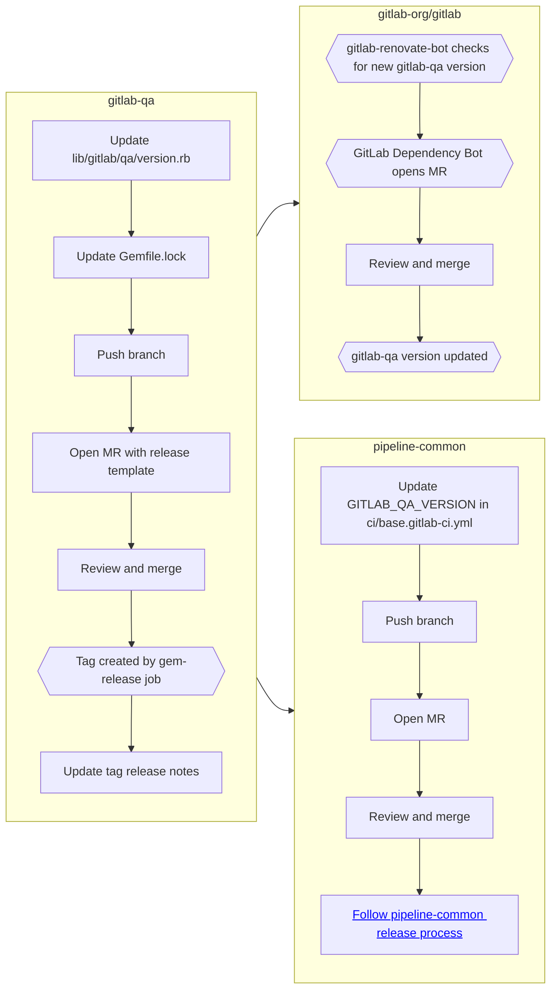

# Release Process

## Versioning

We follow [Semantic Versioning](https://semver.org).  In short, this means that the new version should reflect the types of changes that are about to be released.

> _Summary from semver.org_
>
> MAJOR.MINOR.PATCH
>
> - MAJOR version when you make incompatible API changes,
> - MINOR version when you add functionality in a backward compatible manner
> - PATCH version when you make backward compatible bug fixes.

## When we release

We release `gitlab-qa` on an ad-hoc basis.  There is no regularity to when we release, we just release
when we make a change - no matter the size of the change.

## How-to

- Check if there is an [open merge request to bump the version](https://gitlab.com/gitlab-org/gitlab-qa/merge_requests?scope=all&utf8=%E2%9C%93&state=opened&search=bump+version) (to avoid creating a duplicate).
  - If there is one, update it if necessary.
  - If not, update [`lib/gitlab/qa/version.rb`] to an appropriate [semantic version](https://semver.org) in a new merge request using the [release template](https://gitlab.com/gitlab-org/gitlab-qa/blob/master/.gitlab/merge_request_templates/Release.md)
    and title the MR like `"Bump version to <version>"`.
    - Run `bundle install` to update the `Gemfile.lock` with the new version number of `gitlab-qa`.
- Merge the merge request.
- The new version should automatically be tagged and pushed to Rubygems by the `gem-release` job in the merge commit pipeline.
- Update the release notes for the newly created tag (https://gitlab.com/gitlab-org/gitlab-qa/-/tags):
  - **Release notes**: Copy the release notes from the merge request.

Note: The `gem-release` job uses:

- the `GITLAB_API_TOKEN` environment variable to authenticate against GitLab.com's API in order to create the tag
- the `GEM_HOST_API_KEY` environment variable to authenticate against Rubygems.org's API in order to release the gem

## Post-release maintenance

Please note that `gitlab-qa` version in `gitlab-org/gitlab` project will be updated automatically by [renovate-gitlab-bot](https://gitlab.com/gitlab-org/frontend/renovate-gitlab-bot). However, for live environment pipelines we need to specify the version in [pipeline-common](https://gitlab.com/gitlab-org/quality/pipeline-common) project manually. Remember to open an MR updating `GITLAB_QA_VERSION` value in [base.gitlab-ci.yml](https://gitlab.com/gitlab-org/quality/pipeline-common/-/blob/master/ci/base.gitlab-ci.yml#L4) shortly after the new version is released.

## Flowchart

The flowchart below outlines a high-level overview of the `gitlab-qa` release process, along with post-release maintenance items required
to update the `gitlab-qa` version for our pipelines.

### Key

- Rectangles represent manual actions
- Hexagons represent automated actions

[`lib/gitlab/qa/version.rb`]: https://gitlab.com/gitlab-org/gitlab-qa/blob/master/lib/gitlab/qa/version.rb#L3
